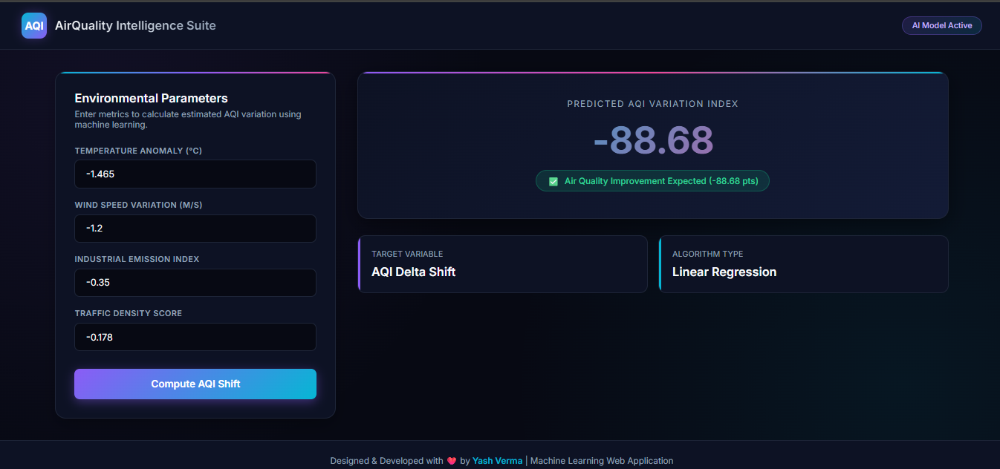

# 🌍 AirQuality Intelligence Suite (AQI Shift Predictor)

> A modern, full-stack machine learning web application built with **FastAPI** and **Scikit-Learn** that predicts real-time Air Quality Index (AQI) variations based on meteorological and industrial metrics.

---

## ✨ Features

* **🧠 Machine Learning Integration:** Uses a trained Linear Regression model (`model.pkl`) to calculate estimated AQI delta shifts.
* **🎨 Modern Multi-Color UI:** Designed with a futuristic dark-mode dashboard, glowing gradients (Cyan & Purple accents), and interactive form controls.
* **⚡ High-Performance Backend:** Powered by **FastAPI**, offering asynchronous request handling and fast response times via **Jinja2** templates.
* **📊 Live Analytics & Status Alerts:** Automatically evaluates whether the predicted metric leads to air quality degradation or improvement with dynamic warning/success badges.

---

## 🛠️ Tech Stack

* **Backend:** Python, FastAPI, Uvicorn, Scikit-Learn, NumPy, Jinja2, Python-Multipart
* **Frontend:** HTML5, CSS3 (Custom Grid Layout & CSS Variables), Google Fonts (Inter)

---
## 🖥️ Preview Dashboard




## 📂 Project Structure

```text
AOI/
│
├── main.py             # FastAPI backend application
├── model.pkl           # Trained Linear Regression model
├── requirements.txt    # Python dependencies
├── virenv/             # Virtual environment directory
└── templates/
    └── index.html      # Full-page responsive dashboard UI

🚀 Getting Started Locally
If you want to run or test this project on your local machine, follow these simple steps:

1. Clone the Repository
git clone [https://github.com/Yashcoder3627/AQI_SHIFT_PREDICTOR.git](https://github.com/Yashcoder3627/AQI_SHIFT_PREDICTOR.git)
cd AQI_SHIFT_PREDICTOR

2. Create and Activate a Virtual Environment
python -m venv virenv
# On Windows:
virenv\Scripts\activate
# On macOS/Linux:
source virenv/bin/activate

3. Install Dependencies
pip install -r requirements.txt

4. Run the FastAPI Server
uvicorn main:app --reload

5. Access the Web App
[http://127.0.0.1:8000](http://127.0.0.1:8000)

👨‍💻 Author
Designed & Developed with ❤️ by Yash Verma

Machine Learning & Full-Stack Web Application Project
